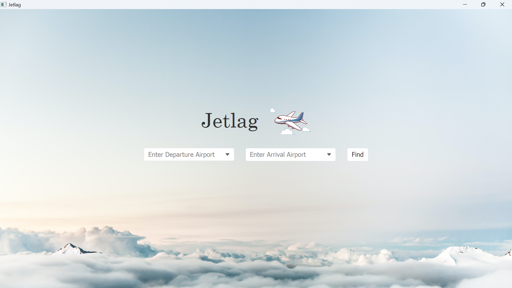

# Jetlag 
Jetlag is a JavaFX application that helps users find the cheapest route between two airports, along with flight details and costs.

### System Requirements
> Operating System: Windows, macOS, or Linux\
> Java Version: Java 8 or later\
> JavaFX: If using Java 11 or later, download and configure JavaFX separately

### Setup
1. Open your preferred Java IDE (Eclipse, IntelliJ, NetBeans) and import the Jetlag project into your IDE. 
2. Configure the JavaFX SDK in your project settings. _Some IDEs, like IntelliJ IDEA or Eclipse, often have built-in features to configure JavaFX. Check your IDE documentation for how to set up JavaFX for your project._

### Using Jetlag
Begin by running the `Main.java` file. The Jetlag application window should open. If not, ensure that your IDE is set up to launch JavaFX applications.

*The initial Jetlag window.*

#### Searching for Flights
Enter (or click the dropdown and scroll to find) the desired departure and arrival airports in the search boxes. 

> When typing, the box should filter to what you are typing. If you enter an airport not included in the dropdown, the program will be unable to assist you.

#### Viewing Results
Click the `Find` button to display flight information.

- Click the "Clear" button to clear the results and search boxes.

5. Running the Jetlag Program
Run the Program:

Start the Main class as the main class for your project.
Ensure that your IDE is set up to launch JavaFX applications.
Interacting with the Jetlag Application:

The Jetlag application window will open.
Enter the departure and arrival airports in the search boxes.
Click the "Find" button to display flight information.
Clearing Results:

Click the "Clear" button to clear the results and search boxes.
Explore the Features:
